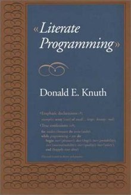

----
marp: true
----

# Creative Jupyter

Tools for literate computing, exploration, collaboration.

> Pycon Balkan 2019, 2019-10-04, 11:30-12:00, Belgrade
> Martin Czygan, gh@miku <!-- martin.czygan@gmail.com -->

----

# About Me

* Software Developer, Data Engineer, Leipzig University Library (DE), [gh/miku](https://github.com/miku)
* Part-time: Author, Trainer

----

# Personal History

* IPython REPL for daily work (API exploration, data digging, ...)
* Jupyter for Python courses
* Jupyter for semi-ad-hoc analysis
* Collected material for book on Jupyter, but still long way to go ...
* Regular exposure to data related problems

----

# Creativity in Context

* have **material** available
* have **tools** available
* progress and **trial and error**
* comments and **collaboration**

----

# Programming Context

Translated to programming and data context:

* (1) materials (data)
* (2) tools for exploration (languages, libraries, extensions)
* (3) experiments, allow for failure (version control)
* (4) comments and sharing (packaging, sharing, reproducibility)

----

# Literate programming



* original paper from Knuth (1984)
* similar but different idea: write one document, generate executable and
  documentation from the same source 
* alternative names: literate computing, interactive computing

----

# (1) Materials

* What data you want to access?
* How do you access data in notebooks?

----

# (1) Materials

Example data access scenarios:

> A company wants to run **business analysis** across data from different databases (articles, customers, ...) or other systems (search, API)

> Exploratory analysis in **scientific context**, e.g. weather data, ...

> Data **journalism**.

----

# (1) Material

Options to make raw data available:

* download file and put it the repo (e.g. under `data` folder)
* have a `download.sh` script fetching larger data sets
* expose `obj.load()` or `obj.load_data()` functions on dataset helpers
* factor out an **adapter library**, that will allow to access data quickly

----

# (1) Material

Options for other artifacts; e.g. ML toolkits (sklearn, tensorflow.datasets,
keras, pytorch) include utilities for varied formats (tarball, npz, ...).

```
In [3]: _ = cifar10.load_data()
Downloading data from https://www.cs.toronto.edu/~kriz/cifar-10-python.tar.gz

In [4]: from keras.datasets import reuters

In [5]: x = reuters.load_data()
Downloading data from https://s3.amazonaws.com/text-datasets/reuters.npz
```

----

# (1) Material Example

Example:

> Performance evaluation of various search systems: catalog frontends, search
> APIs. Wrote small wrapper library (about 600 SLOC), exposing objects with a
> common interface (e.g. a `search` method, taking a query string, returning
> results and metadata from 3 kinds of systems).

Quick generation of input data on the fly, then open up questions:

* Performance
* Query result overlaps and similarity
* ...

----

# (1) Material Example


----

# (1) Material Example

Advantages:

* data access module independent of notebook (e.g. usable in IPython or any other script)
* notebooks are readable documents (broader audience), no extra report needed
* adjustable

----


# (1) Material

Generic ways to package data:

* [data package](https://frictionlessdata.io/docs/data-package/), [spec](https://frictionlessdata.io/specs/data-package/)
* [json stat](https://json-stat.org/)

> **Data dissemination is not the business of a few anymore**. Even though the
> JSON-stat format can be the perfect companion for the open data initiatives of
> National Statistical Offices, it is suitable for all kinds of data
> disseminators because it has been designed with simplicity in mind.

----

# (1) Material Demo

* Making data accessible quickly.
* Example: demos/Accessing JSON Stat.ipynb

<!--

    1. jsonstat example - from SI, MAKSTAT, ...
    2. Load some *Deep Learning* model quickly.
    
    >>> import tensorflow_datasets as tfds

    >>> tfds.load() # ...

    # **Warning**: calling this function might potentially trigger the 
    # download of hundreds of GiB to disk. Refer to the `download` argument.

    # https://www.tensorflow.org/datasets/catalog/overview

Datasets are distributed in all kinds of formats and in all kinds of places,
and they're not always stored in a format that's ready to feed into a machine learning pipeline. Enter TFDS.

TFDS provides a way to transform all those datasets into a standard format, do the preprocessing necessary to make them ready for a machine learning pipeline, and provides a standard input pipeline using tf.data.

* https://www.tensorflow.org/datasets/add_dataset

In [9]: len(tfds.list_builders())
Out[9]: 101

In [11]: _  = tfds.load("caltech101")
Downloading and preparing dataset caltech101 (125.64 MiB) to /home/tir/tensorflow_datasets/caltech101/1.1.0...

-->

----

# (2) Tools

For most things, you will need an external library. Basic Python practices
apply, among them: try to isolate your environment:

* documentation
* reproducibility

----

# (2) Tools

Can be as simple as a [watermark](https://github.com/rasbt/watermark), a Jupyter
magic `%` extension to timestamp a notebook along with SW and HW information.


----

# (2) Tools

> Make it simple to go from a repo to a notebook locally.

When using a virtual environment.

Setup.

```shell
$ python -m ipykernel install --user --name=myenv
Installed kernelspec myenv in $HOME/.local/share/jupyter/kernels/myenv
```

Teardown.

```shell
$ jupyter kernelspec uninstall myenv
```

----

# (3) Experiments

Although notebooks are in a textual format (JSON), they are hard to version
control, since there is some state associated with the execution.

----

# (3) Experiments

There are tools to work around that, e.g. Notedown and Jupytext.

* Notedown, write markdown and convert to a notebook
* Jupytext, associate Markdown file with Notebook and sync them
* nbstripout, clean output cells

----

# (3) Notedown

* convert between various formats (markdown, Rmd, ipynb)
* works, albeit maybe less maintained, with some forks, e.g. [knitty](https://github.com/kiwi0fruit/knitty)
* demo

----

# (3) Jupytext

* bidirectional
* uses the [contents API](https://jupyter-notebook.readthedocs.io/en/stable/extending/contents.html#contents-api)
* allows to create plaintext workflows, using Python, Markdown and a few other formats
* programmatic access
* demo, conversion, programmatic access

----

# (3) nbstripout

* strips output cell
* can be part a pre-commit hook
* demo

----

# (4) Colaboration

* Run a server and use token to share a workspace (e.g. in a container)
* Run JupyterHub -- TLJH (1-100 users, support for [ARM](https://github.com/jupyterhub/the-littlest-jupyterhub/issues/62), WIP)

----

# (4) The littlest JupyterHub (TLJH)

* 1-100 users
* runs on Ubuntu 18.04

----

# (4) Binder

> Turn a Git repo into a collection of interactive notebooks.

> Have a repository full of Jupyter notebooks? With Binder, open those notebooks
> in an executable environment, making your code immediately reproducible by
> anyone, anywhere.

----

# (4) Turn notebooks into containers

* repo2docker

> repo2docker can build a reproducible computational environment for any
> repository that follows The Reproducible Execution Environment Specification. 

It looks for a various [configuration files](https://repo2docker.readthedocs.io/en/latest/config_files.html#config-files).

* demo, generation of a Dockerfile

----

# (4) Install as Cloud Native application

* [Kubeflow](https://www.kubeflow.org/docs/notebooks/)

> What is Kubeflow? The Kubeflow project is dedicated to making deployments of
> machine learning (ML) workflows on Kubernetes simple, portable and scalable.

> Enabling easier **notebook sharing** across the organization. Users can create
> notebook containers or pods directly in the cluster, rather than locally on
> their workstations.

* Jupyter notebooks as experimental setup
* Data volumes can be mounted
* Tries to model end-to-end workflow, up to e.g. ML model serving

----

# (4) Export to various formats

Export Notebooks as slides, PDF and other formats with [nbconvert](https://nbconvert.readthedocs.io/en/latest/usage.html).

* demo: PDF export

----

# (4) Platforms

* bringing data and people together
* hide operational complexity, e.g. preparation of datasets, clusters

Examples:

* An internal data science platform based on Spark and Jupyter ([blog](https://www.adyen.com/blog/building-our-data-science-platform-with-spark-and-jupyter))
* Quantopian Notebooks (https://www.quantopian.com/notebooks/survey)

> A hosted research environment with flexible data access, custom plotting, and
> post-hoc analysis on backtest and live trading results in an IPython Notebook.

----

# Wrap up

* Jupyter Notebooks work standalone and have many extension points
* Both data integration and reproducibility features are getting better
* Formats available for version control
* Platforms emerge, domain-specific tasks, cloud and on premise

----

# Thanks
